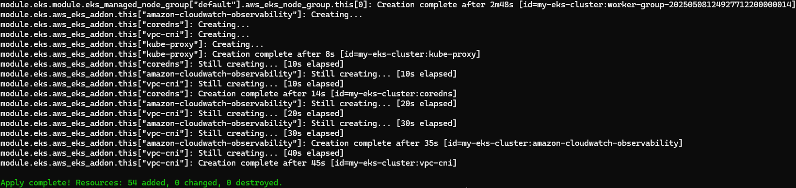
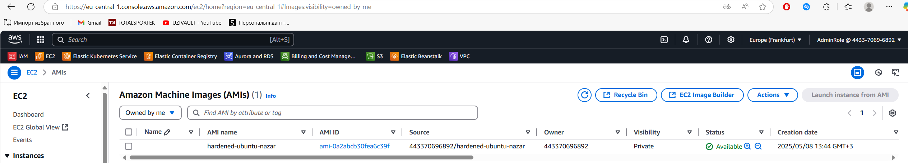
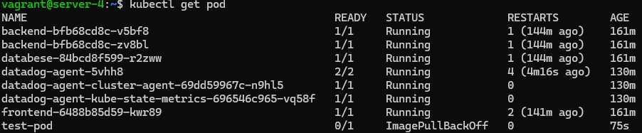

# HelmChart-Nginx

Створив кластер minikube (до останього завдання потрібно), написав helm chart для nginx/hello і задеплоїв у кластер.

# Результат у браузері

# Результат деплою

# Результат у кластері

