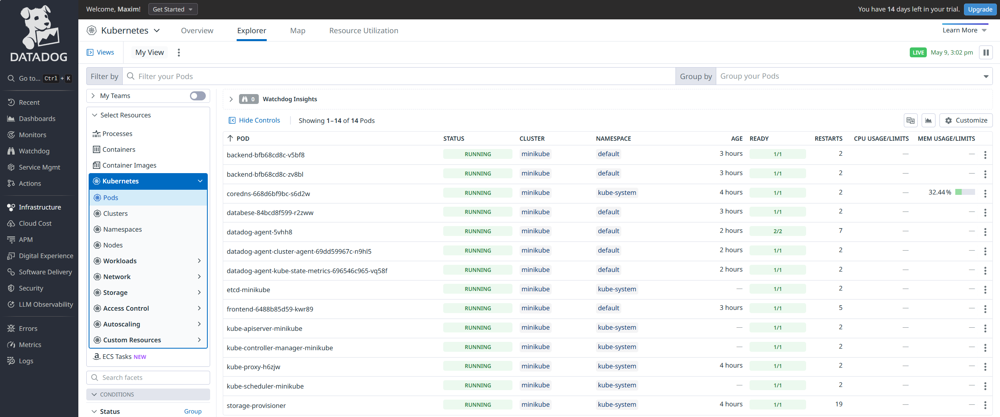

# DD-Minikube-Terrafrom

Підлючив DD до кластеру через Helm Chart DD і свого кастомного файлу dd.yml, задеплоїв свою апку щоб бачити метрики. Через Terrafrom створив alert у dd на ImagePullBackOff.

# Кластер у DataDog

# Alert створений Terraform

# Test pod для alert

