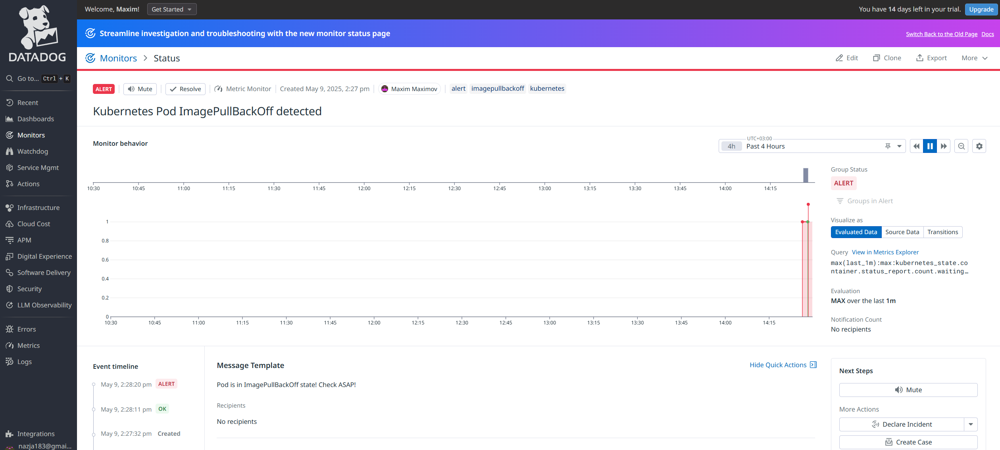

# Concourse-pipeline-Hello-World

Запускав все на віртуалці, тому замість localhost використовував ip машини, запускав через docker compose, запускав одразу з базою, додав DNS щоб скачувати імеджі з Dockerhub і написав простий pipeline для виведення Hello World через bash.

# Результат на віртуалці

# Результат у UI

